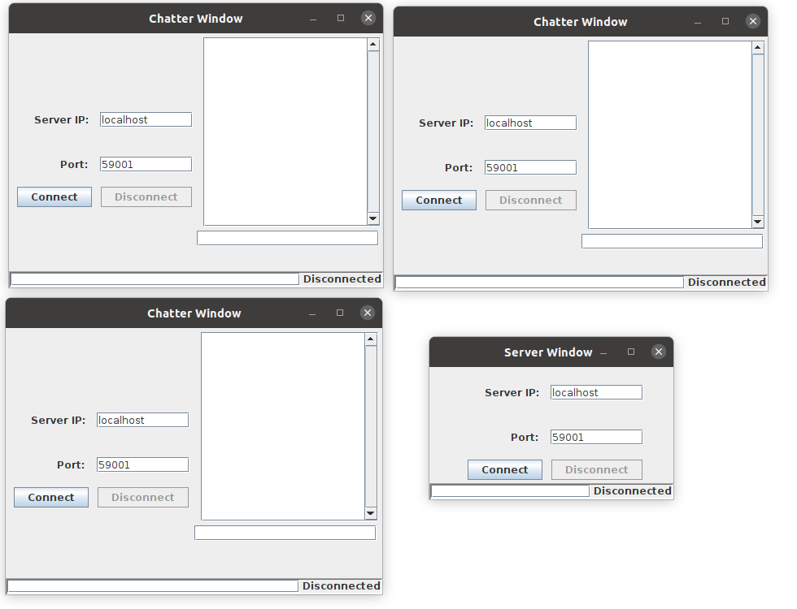
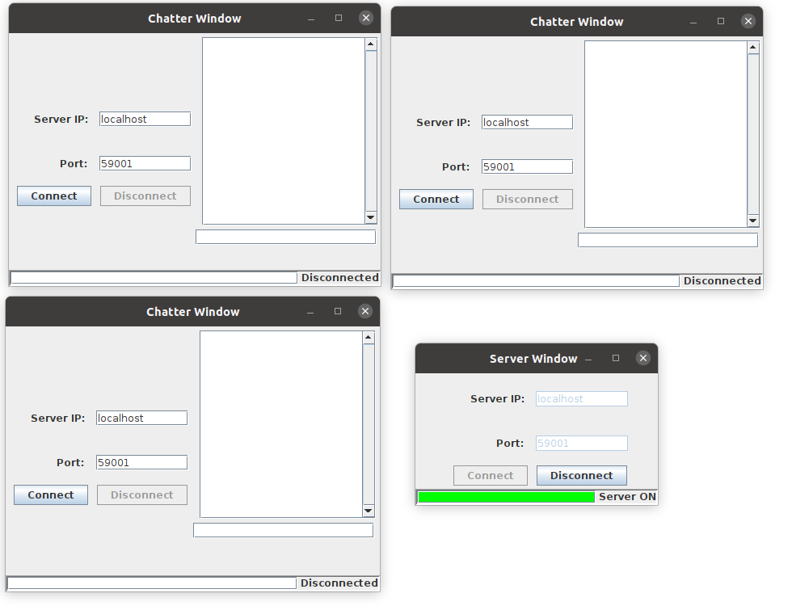
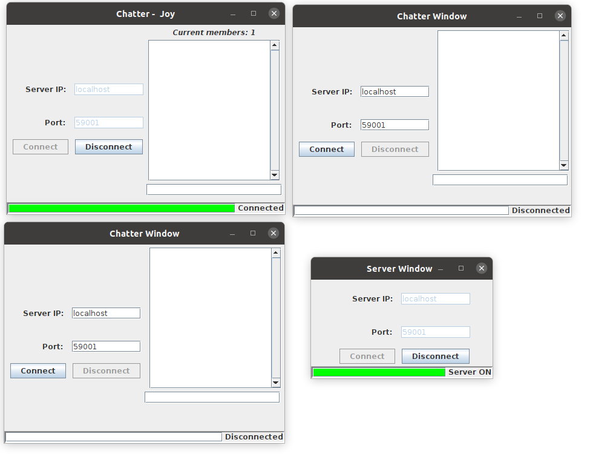
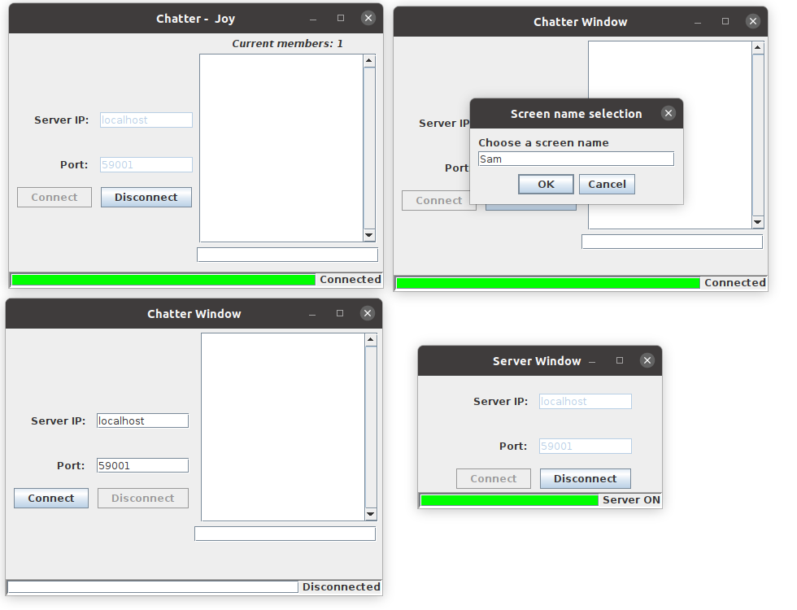
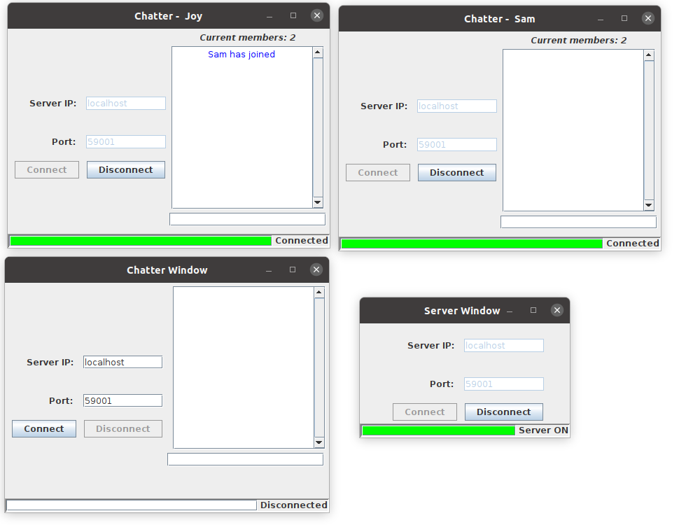
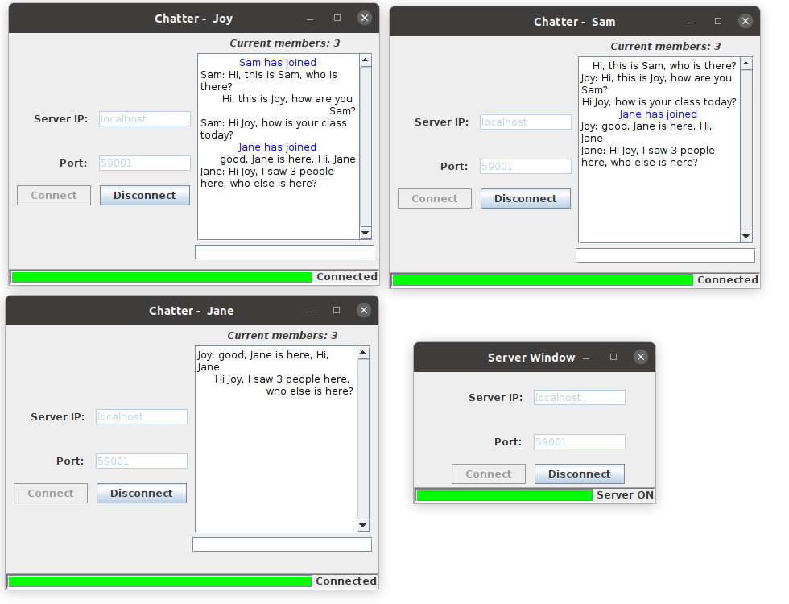
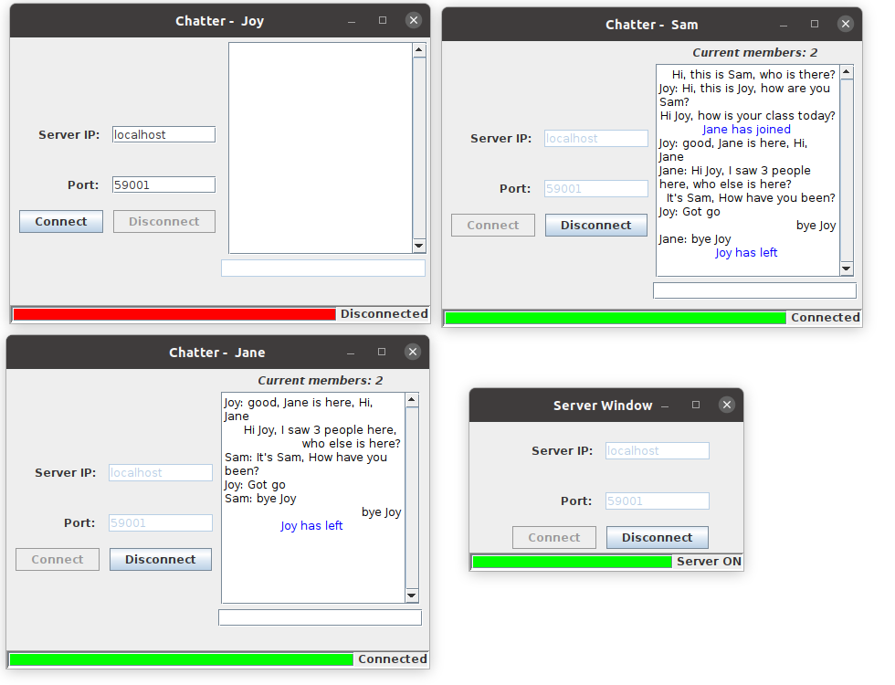

# A simple group chat application using Java

### background
* A GUI application for studying client-server, socket, threadpool, and concurrency
    - It uses java swing to create user interface, and applies client-server to support multi-users group chat.
    - It set a fixed thread pool with 10 threads, you can increase it if you need more.
    - this project is inspired by the two blogs.
        * check out [reference1](https://cs.lmu.edu/~ray/notes/javanetexamples/)
        * check out [reference2](https://ashishmyles.com/tutorials/tcpchat/index.html)

### functionalities
* Connection panels with hostIP and port
    - support client and server connect and disconnect.
    - all disconnected
    
    - server ON
    
    - one user ON
    

* connection status bar 
    - support status report on connecting: connected, disconnected, etc.

* chatter name selection
    - support name for each connected chatter
    - keep asking for name if input name is not unique
    

* total chatters online
    - support display of the number of current chatters in the room
    

* message formatting
    - support system messages with blue color shown in the middle
    - support other chatters messages shown on the left of the panel
    - support self message display on the right side
    

* multi-users group chat
    - support multiple users join, leave, and rejoin
    

### A demo with three users in the group chat

### Happy exploring! Star if you like it!